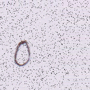
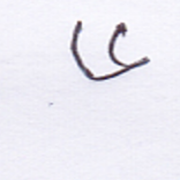

# Bengali Handwritten Digit Recognizer

This is a model based on Convolutional Neural Network(CNN) to recognize bengali handwritten digits. This model was submitted for a [competition](https://www.kaggle.com/c/numta) in kaggle. It achieved 91.4% accuracy on the performance benchmark.

If you face trouble opening the `.ipynb` file in `Github`, you can use [nbviewer](https://nbviewer.jupyter.org/).

## Sample data

Some sample data are shown below

## Image Preprocessing

Image preprocessing included the following steps:

- Color images are converted to gray scale image.
- For better understanding, images are unblurred and laplacian filter is used to make images sharper.
- To get better performance, rotated images are aligned and all images are zoomed upto bounding rectangle.

## Model

The model was trained using 72045 images. The model architechure is given below:

- **Input**: 28 x 28 image
- **Conv_1**: 5 x 5 kernel, 32 feature maps
- **Max-Pooling**: 2 x 2
- **Conv_2**: 3 x 3 kernel, 128 feature maps
- **Max-Pooling**: 2 x 2
- **Conv_3**: 3 x 3 kernel, 256 feature maps
- **Max-Pooling**: 2 x 2
- **Fully-Connected**: 200 neurons, with dropout
- **Fully-Connected**: 200 neurons, with dropout
- **Output**: 10 neurons
- `ReLu` activation function in used all layer except final layer, which uses `Softmax` activation
